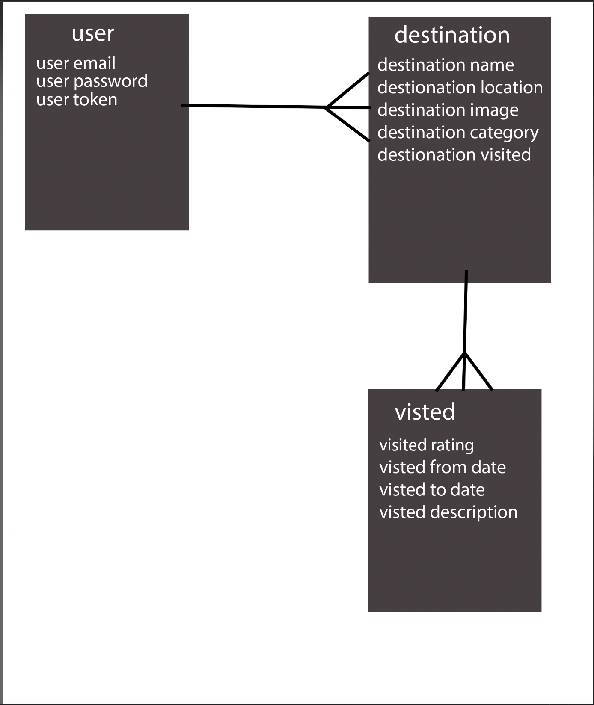

# TEAM GhostBustr

- A REST api of haunted locations with RESTful routes setup for: https://github.com/ivycle94/GhostBustr-client

# ERD:

# Installation Instructions:
1. fork & clone this repo
2. run `npm install` to install dependecies.
3. run `npm run seed` to seed the data.

# Tech Used:
- Node.js
- Mongoose
- Mongodb
